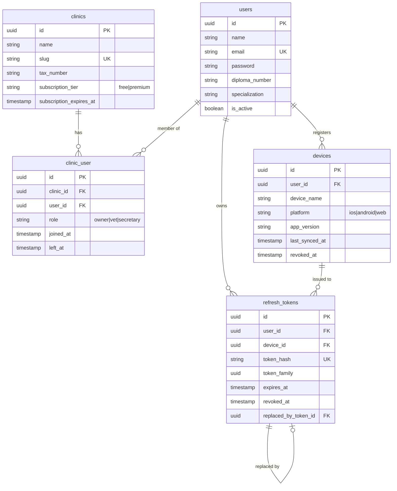
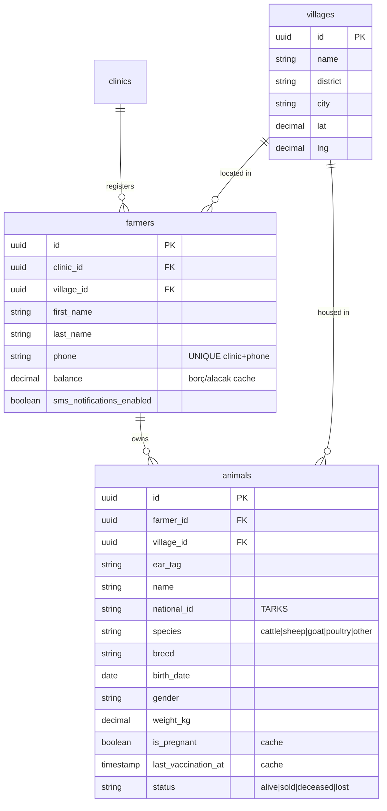
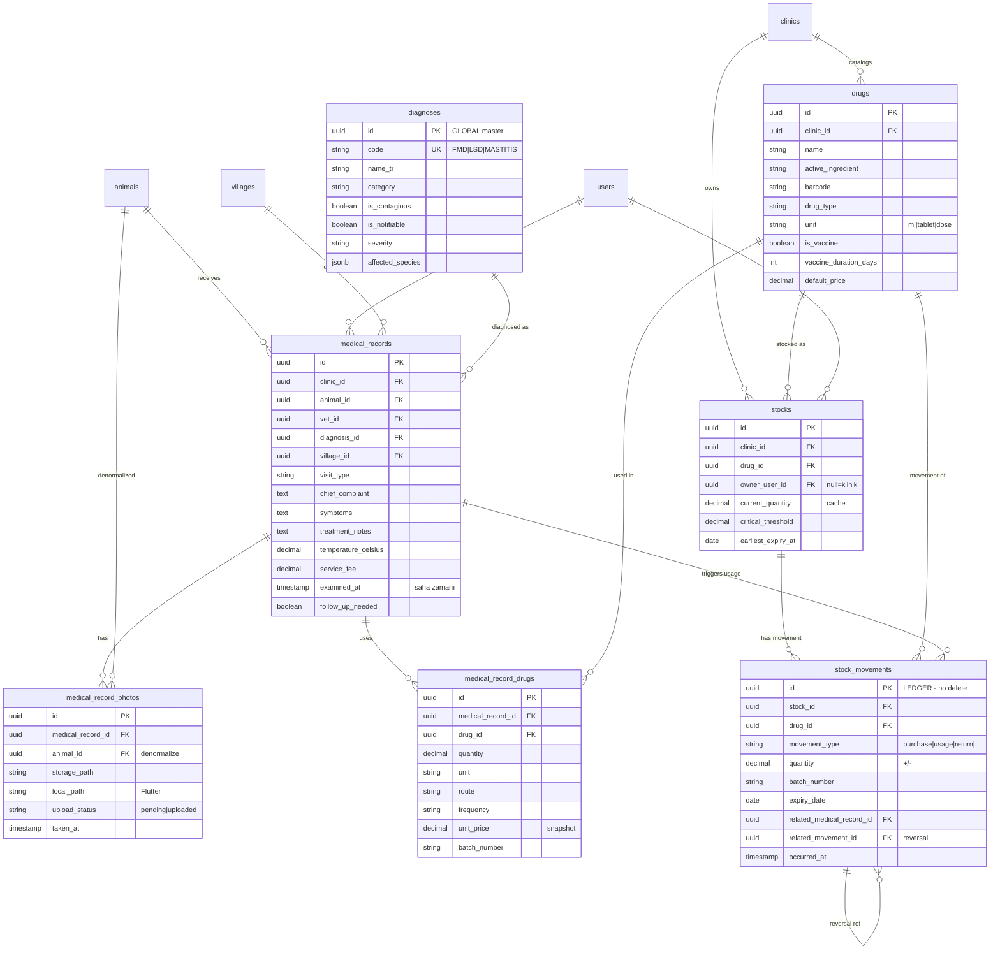
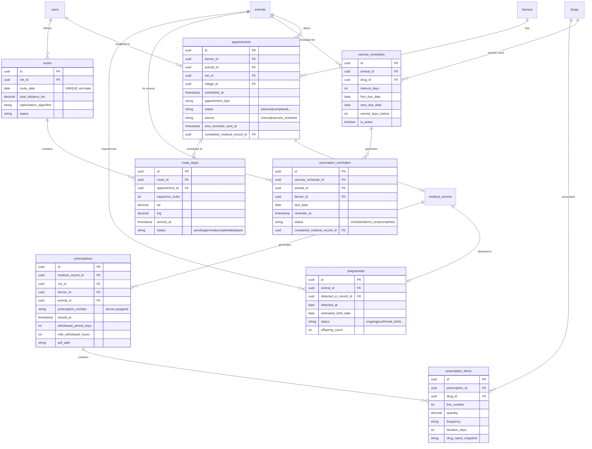
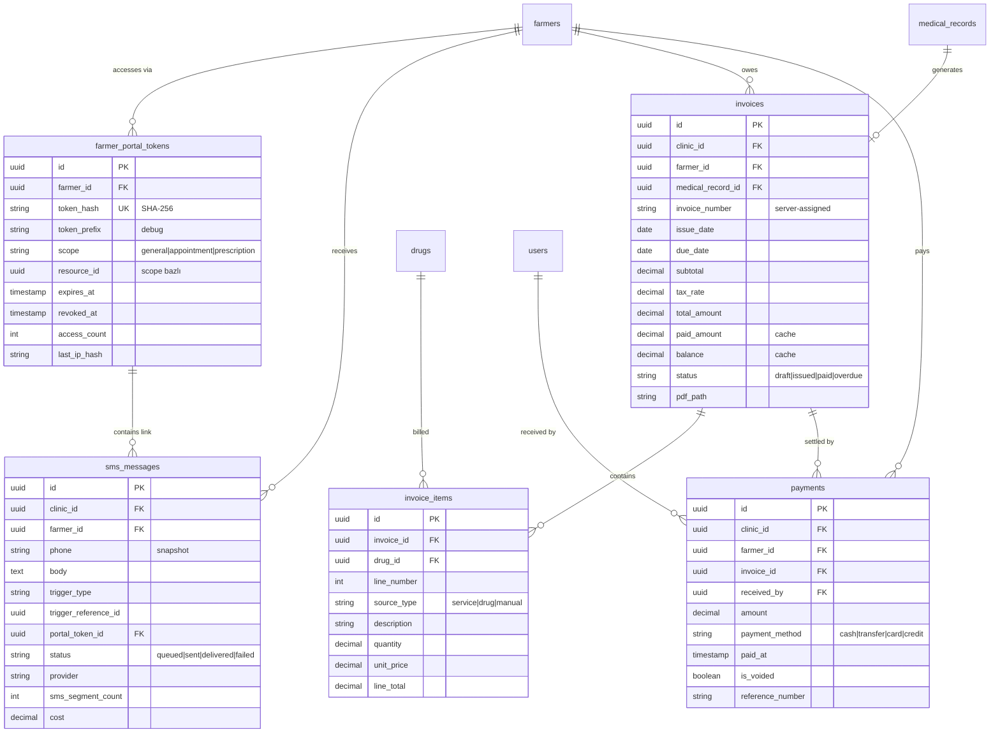
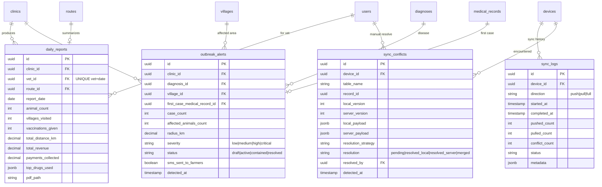

# VetRota — Veri Modeli Dokümanı

> **Sürüm:** 1.0
> **Tarih:** 19 Nisan 2026
> **Kapsam:** MVP — Free + Premium tüm özellikler
> **Hedef Milestone:** M1 → M8 (plan.md)

Bu doküman VetRota'nın PostgreSQL şemasını, Flutter tarafındaki Drift
karşılığının prensiplerini ve offline-first sync mimarisini destekleyen
tüm veri modeli kararlarını içerir.

---

## İçindekiler

1. [Genel Prensipler](#1-genel-prensipler)
2. [Sync Mimarisi ve Ortak Kolonlar](#2-sync-mimarisi-ve-ortak-kolonlar)
3. [Tablo Envanteri](#3-tablo-envanteri)
4. [ER Diyagramları (Gruplu)](#4-er-diyagramları-gruplu)
5. [Tablo Detayları — SQL Tanımları](#5-tablo-detayları--sql-tanımları)
6. [Tasarım Kararları ve Gerekçeler](#6-tasarım-kararları-ve-gerekçeler)
7. [Conflict Resolution Stratejisi](#7-conflict-resolution-stratejisi)
8. [Milestone Eşleşmesi](#8-milestone-eşleşmesi)

---

## 1. Genel Prensipler

### 1.1 Offline-First Felsefesi

Flutter mobil uygulaması, sahada internet olmadığı varsayılarak tasarlanır.
Tüm CRUD işlemleri önce Drift (SQLite) yerel veritabanında gerçekleşir,
sonra sync kanalı üzerinden server'a iletilir. Veri modeli bu akışı
destekler.

### 1.2 Temel Kararlar

| Prensip | Gerekçe |
|---|---|
| **UUID primary key** (auto-increment değil) | Cihaz offline ID üretebilsin, ID uzayı paylaşılsın |
| **Soft delete** (`deleted_at`) | Offline'da silinen kayıtlar başka cihazlarda hâlâ referans alıyor olabilir |
| **Additive ledger** (stok hareketleri, ödemeler) | Conflict'te hiçbir hareket kaybolmasın |
| **Denormalize cache** (`balance`, `current_quantity`, `is_pregnant`) | Offline'da anlık sorgular için |
| **Snapshot kolonlar** (`drug_name_snapshot`, `phone` log'ta) | Master kayıt değişse/silinse bile geçmiş tutarlı kalsın |
| **Global vs clinic-scoped master** | `diagnoses` global, `drugs` klinik bazlı |
| **Server-assigned numaralar** (`invoice_number`, `prescription_number`) | Offline çakışmayı önle |

### 1.3 Veritabanı Teknolojisi

- **Server:** PostgreSQL 16
- **Flutter Local:** Drift (SQLite tabanlı) — şema server ile paraleldir
  ama Flutter tarafında ek `sync_status` alanı bulunur
- **Zaman:** Tüm `TIMESTAMPTZ` (UTC) olarak tutulur, client UI kendi
  timezone'unda render eder

---

## 2. Sync Mimarisi ve Ortak Kolonlar

### 2.1 Her Sync Tablosunda Zorunlu Kolonlar

Çekirdek domain tablolarının **tümünde** aşağıdaki 7 kolon bulunur.
Sync dışı tablolarda (sync_logs, refresh_tokens, sms_messages,
daily_reports, farmer_portal_tokens) bunların bir kısmı veya hiçbiri yer almaz.

```sql
id                UUID PRIMARY KEY DEFAULT gen_random_uuid(),
created_at        TIMESTAMPTZ NOT NULL DEFAULT now(),
updated_at        TIMESTAMPTZ NOT NULL DEFAULT now(),
deleted_at        TIMESTAMPTZ NULL,
last_modified_at  TIMESTAMPTZ NOT NULL DEFAULT now(),
origin_device_id  UUID NULL REFERENCES devices(id),
version           INTEGER NOT NULL DEFAULT 1
```

### 2.2 Ortak Kolonların Rolleri

| Kolon | Rol |
|---|---|
| `id` | Offline ID ataması için UUID |
| `created_at` | Kayıt server'a ilk düştüğü an |
| `updated_at` | Her değişiklikte (Laravel default) |
| `deleted_at` | Soft delete — sync sırasında FK tutarlılığı korunsun |
| `last_modified_at` | **Sadece sync-worthy değişikliklerde** — delta pull kriteri |
| `origin_device_id` | Echo prevention — kaydı gönderen cihaza geri dönmesin |
| `version` | Optimistic locking — conflict tespiti |

### 2.3 Flutter'a Özel Kolon

```dart
// Drift şemasında server'da OLMAYAN ek kolon
TextColumn get syncStatus => text().withDefault(const Constant('synced'))();
// Değerler: 'pending' | 'syncing' | 'synced' | 'conflict' | 'error'
```

### 2.4 Otomatik Version Artışı — PostgreSQL Trigger

Her sync tablosuna aşağıdaki trigger uygulanır:

```sql
CREATE OR REPLACE FUNCTION bump_sync_columns()
RETURNS TRIGGER AS $$
BEGIN
    NEW.version = OLD.version + 1;
    NEW.last_modified_at = now();
    NEW.updated_at = now();
    RETURN NEW;
END;
$$ LANGUAGE plpgsql;

-- Örnek kullanım
CREATE TRIGGER animals_bump_sync BEFORE UPDATE ON animals
    FOR EACH ROW EXECUTE FUNCTION bump_sync_columns();
```

**Sync push için dikkat:** Server sync push endpoint'i `version`'u
manuel yönetir (Laravel `DB::update()` veya `saveQuietly()` ile trigger
bypass). Normal API çağrıları trigger'dan geçer.

---

## 3. Tablo Envanteri

**Toplam: 32 tablo**, 10 mantıksal grupta organize edilmiştir.

| # | Tablo | Grup | Sync? |
|---|---|---|---|
| 1 | `devices` | Sync altyapısı | ✅ |
| 2 | `sync_logs` | Sync altyapısı | ❌ (server-only) |
| 3 | `sync_conflicts` | Sync altyapısı | ❌ (server-only) |
| 4 | `clinics` | Kimlik/Org | ✅ |
| 5 | `users` | Kimlik/Org | ✅ |
| 6 | `clinic_user` | Kimlik/Org | ⚠️ (nadir değişir) |
| 7 | `refresh_tokens` | Auth | ❌ (server-only) |
| 8 | `villages` | Çekirdek | ✅ |
| 9 | `farmers` | Çekirdek | ✅ |
| 10 | `animals` | Çekirdek | ✅ |
| 11 | `diagnoses` | Medikal master (global) | ✅ |
| 12 | `drugs` | Medikal | ✅ |
| 13 | `medical_records` | Medikal | ✅ |
| 14 | `medical_record_drugs` | Medikal | ✅ |
| 15 | `medical_record_photos` | Medikal | ✅ |
| 16 | `stocks` | Stok (cache) | ✅ |
| 17 | `stock_movements` | Stok (ledger) | ✅ (no delete) |
| 18 | `appointments` | Randevu | ✅ |
| 19 | `routes` | Rota | ✅ |
| 20 | `route_stops` | Rota | ✅ |
| 21 | `vaccine_schedules` | Aşı | ✅ |
| 22 | `vaccination_reminders` | Aşı | ✅ |
| 23 | `pregnancies` | Üreme | ✅ |
| 24 | `prescriptions` | Reçete | ✅ |
| 25 | `prescription_items` | Reçete | ✅ |
| 26 | `farmer_portal_tokens` | SMS/Portal | ❌ (server-only) |
| 27 | `sms_messages` | SMS log | ❌ (server-only) |
| 28 | `invoices` | Finans | ✅ |
| 29 | `invoice_items` | Finans | ✅ |
| 30 | `payments` | Finans (no delete, void) | ✅ |
| 31 | `daily_reports` | Raporlama | ❌ (server-only) |
| 32 | `outbreak_alerts` | Raporlama | ✅ |

---

## 4. ER Diyagramları (Gruplu)

Aşağıdaki 6 diyagram GitHub ve Claude Projects'te render edilir. Ortak
tablolar (animals, farmers, clinics) birden fazla diyagramda görünür —
bu okunurluk için kasıtlıdır.

### 4.1 Grup 1 — Kimlik, Organizasyon, Auth



### 4.2 Grup 2 — Çekirdek Domain



### 4.3 Grup 3 — Medikal + İlaç + Stok



### 4.4 Grup 4 — Randevu, Rota, Aşı, Gebelik, Reçete



### 4.5 Grup 5 — SMS, Portal, Finans



### 4.6 Grup 6 — Raporlama ve Sync Altyapısı



---

## 5. Tablo Detayları — SQL Tanımları

Aşağıda tüm 32 tablo için PostgreSQL CREATE TABLE ifadeleri yer alır.
Laravel migration'ları bu tanımlardan türetilecektir.

### 5.1 Sync Altyapısı

#### `devices`

```sql
CREATE TABLE devices (
    id UUID PRIMARY KEY DEFAULT gen_random_uuid(),
    user_id UUID NOT NULL REFERENCES users(id) ON DELETE CASCADE,
    device_name TEXT NOT NULL,
    platform TEXT NOT NULL,                    -- 'ios' | 'android' | 'web'
    app_version TEXT NOT NULL,
    last_synced_at TIMESTAMPTZ NULL,
    last_seen_at TIMESTAMPTZ NULL,
    push_token TEXT NULL,                      -- FCM/APNS
    registered_at TIMESTAMPTZ NOT NULL DEFAULT now(),
    revoked_at TIMESTAMPTZ NULL,
    created_at TIMESTAMPTZ NOT NULL DEFAULT now(),
    updated_at TIMESTAMPTZ NOT NULL DEFAULT now()
);

CREATE INDEX idx_devices_user ON devices(user_id) WHERE revoked_at IS NULL;
```

#### `sync_logs`

```sql
CREATE TABLE sync_logs (
    id UUID PRIMARY KEY DEFAULT gen_random_uuid(),
    device_id UUID NOT NULL REFERENCES devices(id) ON DELETE CASCADE,
    direction TEXT NOT NULL,                   -- 'push' | 'pull' | 'full'
    started_at TIMESTAMPTZ NOT NULL,
    completed_at TIMESTAMPTZ NULL,
    pushed_count INTEGER NOT NULL DEFAULT 0,
    pulled_count INTEGER NOT NULL DEFAULT 0,
    conflict_count INTEGER NOT NULL DEFAULT 0,
    status TEXT NOT NULL,                      -- 'in_progress'|'success'|'partial'|'failed'
    error_message TEXT NULL,
    metadata JSONB NULL
);

CREATE INDEX idx_sync_logs_device_time ON sync_logs(device_id, started_at DESC);
```

#### `sync_conflicts`

```sql
CREATE TABLE sync_conflicts (
    id UUID PRIMARY KEY DEFAULT gen_random_uuid(),
    device_id UUID NOT NULL REFERENCES devices(id) ON DELETE CASCADE,
    table_name TEXT NOT NULL,
    record_id UUID NOT NULL,
    local_version INTEGER NOT NULL,
    server_version INTEGER NOT NULL,
    local_payload JSONB NOT NULL,
    server_payload JSONB NOT NULL,
    resolution_strategy TEXT NOT NULL,         -- 'last_write_wins'|'additive_merge'|'manual'
    resolution TEXT NOT NULL DEFAULT 'pending',
    resolved_at TIMESTAMPTZ NULL,
    resolved_by UUID NULL REFERENCES users(id),
    detected_at TIMESTAMPTZ NOT NULL DEFAULT now()
);

CREATE INDEX idx_sync_conflicts_pending ON sync_conflicts(table_name, record_id)
    WHERE resolution = 'pending';
```

### 5.2 Kimlik ve Organizasyon

#### `clinics`

```sql
CREATE TABLE clinics (
    id UUID PRIMARY KEY DEFAULT gen_random_uuid(),
    name TEXT NOT NULL,
    slug TEXT NOT NULL UNIQUE,
    phone TEXT NULL,
    email TEXT NULL,
    address TEXT NULL,
    city TEXT NULL,
    district TEXT NULL,
    tax_number TEXT NULL,
    subscription_tier TEXT NOT NULL DEFAULT 'free',  -- 'free' | 'premium'
    subscription_expires_at TIMESTAMPTZ NULL,

    -- Sync ortak kolonları
    created_at TIMESTAMPTZ NOT NULL DEFAULT now(),
    updated_at TIMESTAMPTZ NOT NULL DEFAULT now(),
    deleted_at TIMESTAMPTZ NULL,
    last_modified_at TIMESTAMPTZ NOT NULL DEFAULT now(),
    origin_device_id UUID NULL REFERENCES devices(id),
    version INTEGER NOT NULL DEFAULT 1
);

CREATE INDEX idx_clinics_subscription ON clinics(subscription_tier)
    WHERE deleted_at IS NULL;
```

#### `users`

```sql
CREATE TABLE users (
    id UUID PRIMARY KEY DEFAULT gen_random_uuid(),
    name TEXT NOT NULL,
    email TEXT NOT NULL UNIQUE,
    phone TEXT NULL,
    email_verified_at TIMESTAMPTZ NULL,
    password TEXT NOT NULL,                    -- bcrypt hash
    remember_token TEXT NULL,
    diploma_number TEXT NULL,
    specialization TEXT NULL,
    is_active BOOLEAN NOT NULL DEFAULT true,
    last_login_at TIMESTAMPTZ NULL,

    -- Sync ortak kolonları
    created_at TIMESTAMPTZ NOT NULL DEFAULT now(),
    updated_at TIMESTAMPTZ NOT NULL DEFAULT now(),
    deleted_at TIMESTAMPTZ NULL,
    last_modified_at TIMESTAMPTZ NOT NULL DEFAULT now(),
    origin_device_id UUID NULL REFERENCES devices(id),
    version INTEGER NOT NULL DEFAULT 1
);

CREATE INDEX idx_users_email ON users(email) WHERE deleted_at IS NULL;
CREATE INDEX idx_users_active ON users(is_active) WHERE deleted_at IS NULL;
```

#### `clinic_user`

```sql
CREATE TABLE clinic_user (
    id UUID PRIMARY KEY DEFAULT gen_random_uuid(),
    clinic_id UUID NOT NULL REFERENCES clinics(id) ON DELETE CASCADE,
    user_id UUID NOT NULL REFERENCES users(id) ON DELETE CASCADE,
    role TEXT NOT NULL,                        -- 'owner' | 'vet' | 'secretary'
    joined_at TIMESTAMPTZ NOT NULL DEFAULT now(),
    left_at TIMESTAMPTZ NULL,

    UNIQUE (clinic_id, user_id)
);

CREATE INDEX idx_clinic_user_user ON clinic_user(user_id) WHERE left_at IS NULL;
CREATE INDEX idx_clinic_user_clinic ON clinic_user(clinic_id) WHERE left_at IS NULL;
```

#### `refresh_tokens`

```sql
CREATE TABLE refresh_tokens (
    id UUID PRIMARY KEY DEFAULT gen_random_uuid(),
    user_id UUID NOT NULL REFERENCES users(id) ON DELETE CASCADE,
    device_id UUID NOT NULL REFERENCES devices(id) ON DELETE CASCADE,
    token_hash TEXT NOT NULL UNIQUE,           -- SHA-256
    token_family UUID NOT NULL,                -- rotation chain
    issued_at TIMESTAMPTZ NOT NULL DEFAULT now(),
    expires_at TIMESTAMPTZ NOT NULL,
    revoked_at TIMESTAMPTZ NULL,
    revoked_reason TEXT NULL,
    replaced_by_token_id UUID NULL REFERENCES refresh_tokens(id) ON DELETE SET NULL,
    last_used_at TIMESTAMPTZ NULL,
    last_ip_hash TEXT NULL,
    last_user_agent TEXT NULL,
    created_at TIMESTAMPTZ NOT NULL DEFAULT now(),
    updated_at TIMESTAMPTZ NOT NULL DEFAULT now()
);

CREATE INDEX idx_refresh_tokens_user ON refresh_tokens(user_id) WHERE revoked_at IS NULL;
CREATE INDEX idx_refresh_tokens_device ON refresh_tokens(device_id) WHERE revoked_at IS NULL;
CREATE INDEX idx_refresh_tokens_family ON refresh_tokens(token_family);
CREATE INDEX idx_refresh_tokens_expiry ON refresh_tokens(expires_at) WHERE revoked_at IS NULL;
```

### 5.3 Çekirdek Domain

#### `villages`

```sql
CREATE TABLE villages (
    id UUID PRIMARY KEY DEFAULT gen_random_uuid(),
    name TEXT NOT NULL,
    district TEXT NOT NULL,
    city TEXT NOT NULL,
    lat NUMERIC(10, 7) NULL,
    lng NUMERIC(10, 7) NULL,

    -- Sync ortak kolonları
    created_at TIMESTAMPTZ NOT NULL DEFAULT now(),
    updated_at TIMESTAMPTZ NOT NULL DEFAULT now(),
    deleted_at TIMESTAMPTZ NULL,
    last_modified_at TIMESTAMPTZ NOT NULL DEFAULT now(),
    origin_device_id UUID NULL REFERENCES devices(id),
    version INTEGER NOT NULL DEFAULT 1,

    UNIQUE (name, district, city)
);

CREATE INDEX idx_villages_location ON villages(city, district);
CREATE INDEX idx_villages_latlng ON villages(lat, lng) WHERE lat IS NOT NULL;
```

#### `farmers`

```sql
CREATE TABLE farmers (
    id UUID PRIMARY KEY DEFAULT gen_random_uuid(),
    clinic_id UUID NOT NULL REFERENCES clinics(id) ON DELETE RESTRICT,
    village_id UUID NULL REFERENCES villages(id) ON DELETE SET NULL,
    first_name TEXT NOT NULL,
    last_name TEXT NOT NULL,
    phone TEXT NOT NULL,
    email TEXT NULL,
    address_detail TEXT NULL,
    balance NUMERIC(12, 2) NOT NULL DEFAULT 0,
    sms_notifications_enabled BOOLEAN NOT NULL DEFAULT true,
    preferred_sms_language TEXT NOT NULL DEFAULT 'tr',
    notes TEXT NULL,

    -- Sync ortak kolonları
    created_at TIMESTAMPTZ NOT NULL DEFAULT now(),
    updated_at TIMESTAMPTZ NOT NULL DEFAULT now(),
    deleted_at TIMESTAMPTZ NULL,
    last_modified_at TIMESTAMPTZ NOT NULL DEFAULT now(),
    origin_device_id UUID NULL REFERENCES devices(id),
    version INTEGER NOT NULL DEFAULT 1,

    UNIQUE (clinic_id, phone)
);

CREATE INDEX idx_farmers_clinic ON farmers(clinic_id) WHERE deleted_at IS NULL;
CREATE INDEX idx_farmers_phone ON farmers(clinic_id, phone) WHERE deleted_at IS NULL;
CREATE INDEX idx_farmers_village ON farmers(village_id) WHERE deleted_at IS NULL;
CREATE INDEX idx_farmers_name_search ON farmers USING gin (
    to_tsvector('turkish', first_name || ' ' || last_name)
) WHERE deleted_at IS NULL;
```

#### `animals`

```sql
CREATE TABLE animals (
    id UUID PRIMARY KEY DEFAULT gen_random_uuid(),
    farmer_id UUID NOT NULL REFERENCES farmers(id) ON DELETE RESTRICT,
    village_id UUID NULL REFERENCES villages(id) ON DELETE SET NULL,
    ear_tag TEXT NULL,
    name TEXT NULL,
    national_id TEXT NULL,                     -- TARKS
    species TEXT NOT NULL CHECK (species IN ('cattle','sheep','goat','poultry','other')),
    breed TEXT NULL,
    birth_date DATE NULL,
    gender TEXT NOT NULL,
    weight_kg NUMERIC(6, 2) NULL,
    color TEXT NULL,
    is_pregnant BOOLEAN NOT NULL DEFAULT false,
    last_vaccination_at TIMESTAMPTZ NULL,
    status TEXT NOT NULL DEFAULT 'alive',
    status_changed_at TIMESTAMPTZ NULL,
    status_notes TEXT NULL,

    -- Sync ortak kolonları
    created_at TIMESTAMPTZ NOT NULL DEFAULT now(),
    updated_at TIMESTAMPTZ NOT NULL DEFAULT now(),
    deleted_at TIMESTAMPTZ NULL,
    last_modified_at TIMESTAMPTZ NOT NULL DEFAULT now(),
    origin_device_id UUID NULL REFERENCES devices(id),
    version INTEGER NOT NULL DEFAULT 1,

    CONSTRAINT chk_animal_status CHECK (status IN ('alive','sold','deceased','lost'))
);

CREATE INDEX idx_animals_farmer ON animals(farmer_id) WHERE deleted_at IS NULL;
CREATE INDEX idx_animals_village ON animals(village_id) WHERE deleted_at IS NULL;
CREATE INDEX idx_animals_ear_tag ON animals(ear_tag)
    WHERE ear_tag IS NOT NULL AND deleted_at IS NULL;
CREATE INDEX idx_animals_status ON animals(status) WHERE deleted_at IS NULL;
CREATE INDEX idx_animals_pregnant ON animals(is_pregnant)
    WHERE is_pregnant = true AND deleted_at IS NULL;
```

### 5.4 Medikal ve Stok

#### `diagnoses` — Global Master

```sql
CREATE TABLE diagnoses (
    id UUID PRIMARY KEY DEFAULT gen_random_uuid(),
    code TEXT NOT NULL UNIQUE,                 -- "FMD", "LSD"
    name_tr TEXT NOT NULL,
    name_latin TEXT NULL,
    category TEXT NOT NULL,                    -- 'infectious'|'parasitic'|'metabolic'|'trauma'|'other'
    is_contagious BOOLEAN NOT NULL DEFAULT false,
    is_notifiable BOOLEAN NOT NULL DEFAULT false,
    severity TEXT NOT NULL DEFAULT 'low',
    affected_species JSONB NOT NULL DEFAULT '["cattle","sheep","goat"]',
    description TEXT NULL,
    typical_symptoms TEXT NULL,

    -- Sync ortak kolonları
    created_at TIMESTAMPTZ NOT NULL DEFAULT now(),
    updated_at TIMESTAMPTZ NOT NULL DEFAULT now(),
    deleted_at TIMESTAMPTZ NULL,
    last_modified_at TIMESTAMPTZ NOT NULL DEFAULT now(),
    origin_device_id UUID NULL REFERENCES devices(id),
    version INTEGER NOT NULL DEFAULT 1
);

CREATE INDEX idx_diagnoses_category ON diagnoses(category) WHERE deleted_at IS NULL;
CREATE INDEX idx_diagnoses_contagious ON diagnoses(is_contagious)
    WHERE is_contagious = true AND deleted_at IS NULL;
CREATE INDEX idx_diagnoses_name_search ON diagnoses USING gin (
    to_tsvector('turkish', name_tr || ' ' || coalesce(name_latin, ''))
) WHERE deleted_at IS NULL;
```

#### `drugs`

```sql
CREATE TABLE drugs (
    id UUID PRIMARY KEY DEFAULT gen_random_uuid(),
    clinic_id UUID NOT NULL REFERENCES clinics(id) ON DELETE RESTRICT,
    name TEXT NOT NULL,
    active_ingredient TEXT NULL,
    manufacturer TEXT NULL,
    barcode TEXT NULL,
    drug_type TEXT NOT NULL,
    requires_prescription BOOLEAN NOT NULL DEFAULT true,
    unit TEXT NOT NULL,                        -- 'ml'|'tablet'|'dose'|'g'
    package_size NUMERIC(10, 2) NULL,
    is_vaccine BOOLEAN NOT NULL DEFAULT false,
    vaccine_duration_days INTEGER NULL,
    suitable_species JSONB NOT NULL DEFAULT '["cattle","sheep","goat"]',
    default_price NUMERIC(10, 2) NULL,

    -- Sync ortak kolonları
    created_at TIMESTAMPTZ NOT NULL DEFAULT now(),
    updated_at TIMESTAMPTZ NOT NULL DEFAULT now(),
    deleted_at TIMESTAMPTZ NULL,
    last_modified_at TIMESTAMPTZ NOT NULL DEFAULT now(),
    origin_device_id UUID NULL REFERENCES devices(id),
    version INTEGER NOT NULL DEFAULT 1,

    UNIQUE (clinic_id, name)
);

CREATE INDEX idx_drugs_clinic ON drugs(clinic_id) WHERE deleted_at IS NULL;
CREATE INDEX idx_drugs_barcode ON drugs(clinic_id, barcode)
    WHERE barcode IS NOT NULL AND deleted_at IS NULL;
CREATE INDEX idx_drugs_vaccine ON drugs(clinic_id, is_vaccine)
    WHERE is_vaccine = true AND deleted_at IS NULL;
CREATE INDEX idx_drugs_type ON drugs(clinic_id, drug_type) WHERE deleted_at IS NULL;
```

#### `medical_records`

```sql
CREATE TABLE medical_records (
    id UUID PRIMARY KEY DEFAULT gen_random_uuid(),
    clinic_id UUID NOT NULL REFERENCES clinics(id) ON DELETE RESTRICT,
    animal_id UUID NOT NULL REFERENCES animals(id) ON DELETE RESTRICT,
    vet_id UUID NOT NULL REFERENCES users(id) ON DELETE RESTRICT,
    diagnosis_id UUID NULL REFERENCES diagnoses(id) ON DELETE SET NULL,
    appointment_id UUID NULL,                  -- FK sonra ALTER TABLE ile eklenir
    village_id UUID NULL REFERENCES villages(id) ON DELETE SET NULL,
    lat NUMERIC(10, 7) NULL,
    lng NUMERIC(10, 7) NULL,
    visit_type TEXT NOT NULL DEFAULT 'examination',
    chief_complaint TEXT NULL,
    symptoms TEXT NULL,
    diagnosis_notes TEXT NULL,
    treatment_notes TEXT NULL,
    recommendations TEXT NULL,
    temperature_celsius NUMERIC(4, 1) NULL,
    weight_kg NUMERIC(6, 2) NULL,
    heart_rate INTEGER NULL,
    respiratory_rate INTEGER NULL,
    service_fee NUMERIC(10, 2) NOT NULL DEFAULT 0,
    invoice_id UUID NULL,                      -- FK sonra ALTER TABLE ile eklenir
    examined_at TIMESTAMPTZ NOT NULL,
    follow_up_needed BOOLEAN NOT NULL DEFAULT false,
    follow_up_date DATE NULL,

    -- Sync ortak kolonları
    created_at TIMESTAMPTZ NOT NULL DEFAULT now(),
    updated_at TIMESTAMPTZ NOT NULL DEFAULT now(),
    deleted_at TIMESTAMPTZ NULL,
    last_modified_at TIMESTAMPTZ NOT NULL DEFAULT now(),
    origin_device_id UUID NULL REFERENCES devices(id),
    version INTEGER NOT NULL DEFAULT 1,

    CONSTRAINT chk_visit_type CHECK (visit_type IN
        ('examination','vaccination','treatment','emergency','routine_check','pregnancy_check'))
);

CREATE INDEX idx_medical_records_animal ON medical_records(animal_id, examined_at DESC)
    WHERE deleted_at IS NULL;
CREATE INDEX idx_medical_records_vet ON medical_records(vet_id, examined_at DESC)
    WHERE deleted_at IS NULL;
CREATE INDEX idx_medical_records_village ON medical_records(village_id, examined_at DESC)
    WHERE deleted_at IS NULL;
CREATE INDEX idx_medical_records_diagnosis ON medical_records(diagnosis_id, examined_at DESC)
    WHERE deleted_at IS NULL;
CREATE INDEX idx_medical_records_followup ON medical_records(follow_up_date)
    WHERE follow_up_needed = true AND deleted_at IS NULL;
CREATE INDEX idx_medical_records_clinic_date ON medical_records(clinic_id, examined_at DESC)
    WHERE deleted_at IS NULL;
```

#### `medical_record_drugs`

```sql
CREATE TABLE medical_record_drugs (
    id UUID PRIMARY KEY DEFAULT gen_random_uuid(),
    medical_record_id UUID NOT NULL REFERENCES medical_records(id) ON DELETE CASCADE,
    drug_id UUID NOT NULL REFERENCES drugs(id) ON DELETE RESTRICT,
    quantity NUMERIC(10, 3) NOT NULL,
    unit TEXT NOT NULL,
    route TEXT NULL,
    frequency TEXT NULL,
    duration_days INTEGER NULL,
    unit_price NUMERIC(10, 2) NOT NULL DEFAULT 0,
    total_price NUMERIC(10, 2) NOT NULL DEFAULT 0,
    batch_number TEXT NULL,
    administered_by UUID NULL REFERENCES users(id),

    -- Sync ortak kolonları
    created_at TIMESTAMPTZ NOT NULL DEFAULT now(),
    updated_at TIMESTAMPTZ NOT NULL DEFAULT now(),
    deleted_at TIMESTAMPTZ NULL,
    last_modified_at TIMESTAMPTZ NOT NULL DEFAULT now(),
    origin_device_id UUID NULL REFERENCES devices(id),
    version INTEGER NOT NULL DEFAULT 1
);

CREATE INDEX idx_mr_drugs_record ON medical_record_drugs(medical_record_id)
    WHERE deleted_at IS NULL;
CREATE INDEX idx_mr_drugs_drug ON medical_record_drugs(drug_id)
    WHERE deleted_at IS NULL;
```

#### `medical_record_photos`

```sql
CREATE TABLE medical_record_photos (
    id UUID PRIMARY KEY DEFAULT gen_random_uuid(),
    medical_record_id UUID NOT NULL REFERENCES medical_records(id) ON DELETE CASCADE,
    animal_id UUID NOT NULL REFERENCES animals(id) ON DELETE RESTRICT,
    storage_path TEXT NULL,
    thumbnail_path TEXT NULL,
    local_path TEXT NULL,
    upload_status TEXT NOT NULL DEFAULT 'pending',
    upload_attempts INTEGER NOT NULL DEFAULT 0,
    upload_error TEXT NULL,
    file_size_bytes BIGINT NULL,
    mime_type TEXT NULL,
    width_px INTEGER NULL,
    height_px INTEGER NULL,
    caption TEXT NULL,
    taken_at TIMESTAMPTZ NOT NULL,

    -- Sync ortak kolonları
    created_at TIMESTAMPTZ NOT NULL DEFAULT now(),
    updated_at TIMESTAMPTZ NOT NULL DEFAULT now(),
    deleted_at TIMESTAMPTZ NULL,
    last_modified_at TIMESTAMPTZ NOT NULL DEFAULT now(),
    origin_device_id UUID NULL REFERENCES devices(id),
    version INTEGER NOT NULL DEFAULT 1,

    CONSTRAINT chk_upload_status CHECK (upload_status IN
        ('pending','uploading','uploaded','failed'))
);

CREATE INDEX idx_mr_photos_record ON medical_record_photos(medical_record_id)
    WHERE deleted_at IS NULL;
CREATE INDEX idx_mr_photos_animal ON medical_record_photos(animal_id, taken_at DESC)
    WHERE deleted_at IS NULL;
CREATE INDEX idx_mr_photos_pending ON medical_record_photos(upload_status, created_at)
    WHERE upload_status IN ('pending','failed') AND deleted_at IS NULL;
```

**Uygulama Seviyesi Kontrolü:** Muayene başına max 10 fotoğraf — Laravel
validation'da kontrol edilir, DB'de constraint yok.

#### `stocks`

```sql
CREATE TABLE stocks (
    id UUID PRIMARY KEY DEFAULT gen_random_uuid(),
    clinic_id UUID NOT NULL REFERENCES clinics(id) ON DELETE CASCADE,
    drug_id UUID NOT NULL REFERENCES drugs(id) ON DELETE RESTRICT,
    owner_user_id UUID NULL REFERENCES users(id) ON DELETE SET NULL,
    current_quantity NUMERIC(12, 3) NOT NULL DEFAULT 0,
    critical_threshold NUMERIC(12, 3) NULL,
    reorder_quantity NUMERIC(12, 3) NULL,
    last_purchased_at TIMESTAMPTZ NULL,
    earliest_expiry_at DATE NULL,

    -- Sync ortak kolonları
    created_at TIMESTAMPTZ NOT NULL DEFAULT now(),
    updated_at TIMESTAMPTZ NOT NULL DEFAULT now(),
    deleted_at TIMESTAMPTZ NULL,
    last_modified_at TIMESTAMPTZ NOT NULL DEFAULT now(),
    origin_device_id UUID NULL REFERENCES devices(id),
    version INTEGER NOT NULL DEFAULT 1
);

-- NULL-safe unique index (PostgreSQL NULL UNIQUE özel davranışı için)
CREATE UNIQUE INDEX stocks_clinic_drug_owner_uniq ON stocks(
    clinic_id, drug_id,
    COALESCE(owner_user_id, '00000000-0000-0000-0000-000000000000'::uuid)
) WHERE deleted_at IS NULL;

CREATE INDEX idx_stocks_clinic ON stocks(clinic_id) WHERE deleted_at IS NULL;
CREATE INDEX idx_stocks_vehicle ON stocks(owner_user_id)
    WHERE owner_user_id IS NOT NULL AND deleted_at IS NULL;
CREATE INDEX idx_stocks_critical ON stocks(clinic_id, drug_id)
    WHERE current_quantity <= critical_threshold AND deleted_at IS NULL;
CREATE INDEX idx_stocks_expiry ON stocks(earliest_expiry_at)
    WHERE earliest_expiry_at IS NOT NULL AND deleted_at IS NULL;
```

#### `stock_movements` — Ledger (No Delete)

```sql
CREATE TABLE stock_movements (
    id UUID PRIMARY KEY DEFAULT gen_random_uuid(),
    stock_id UUID NOT NULL REFERENCES stocks(id) ON DELETE RESTRICT,
    drug_id UUID NOT NULL REFERENCES drugs(id) ON DELETE RESTRICT,
    clinic_id UUID NOT NULL REFERENCES clinics(id) ON DELETE RESTRICT,
    movement_type TEXT NOT NULL,
    quantity NUMERIC(12, 3) NOT NULL,          -- pozitif = giriş, negatif = çıkış
    unit_price NUMERIC(10, 2) NULL,
    batch_number TEXT NULL,
    expiry_date DATE NULL,
    supplier_name TEXT NULL,
    related_medical_record_id UUID NULL REFERENCES medical_records(id) ON DELETE SET NULL,
    related_movement_id UUID NULL REFERENCES stock_movements(id) ON DELETE SET NULL,
    performed_by UUID NOT NULL REFERENCES users(id) ON DELETE RESTRICT,
    notes TEXT NULL,
    occurred_at TIMESTAMPTZ NOT NULL,

    -- Sync ortak kolonları (deleted_at YOK — ledger asla silinmez)
    created_at TIMESTAMPTZ NOT NULL DEFAULT now(),
    updated_at TIMESTAMPTZ NOT NULL DEFAULT now(),
    last_modified_at TIMESTAMPTZ NOT NULL DEFAULT now(),
    origin_device_id UUID NULL REFERENCES devices(id),
    version INTEGER NOT NULL DEFAULT 1,

    CONSTRAINT chk_movement_type CHECK (movement_type IN
        ('purchase','usage','transfer_in','transfer_out','adjustment','waste','return'))
);

CREATE INDEX idx_stock_mov_stock_time ON stock_movements(stock_id, occurred_at DESC);
CREATE INDEX idx_stock_mov_clinic_time ON stock_movements(clinic_id, occurred_at DESC);
CREATE INDEX idx_stock_mov_medical_record ON stock_movements(related_medical_record_id)
    WHERE related_medical_record_id IS NOT NULL;
CREATE INDEX idx_stock_mov_type ON stock_movements(clinic_id, movement_type, occurred_at DESC);
```

### 5.5 Randevu, Rota, Aşı, Gebelik

#### `appointments`

```sql
CREATE TABLE appointments (
    id UUID PRIMARY KEY DEFAULT gen_random_uuid(),
    clinic_id UUID NOT NULL REFERENCES clinics(id) ON DELETE RESTRICT,
    farmer_id UUID NOT NULL REFERENCES farmers(id) ON DELETE RESTRICT,
    animal_id UUID NULL REFERENCES animals(id) ON DELETE SET NULL,
    vet_id UUID NOT NULL REFERENCES users(id) ON DELETE RESTRICT,
    village_id UUID NULL REFERENCES villages(id) ON DELETE SET NULL,
    scheduled_at TIMESTAMPTZ NOT NULL,
    estimated_duration_minutes INTEGER NULL DEFAULT 30,
    appointment_type TEXT NOT NULL DEFAULT 'visit',
    reason TEXT NULL,
    notes TEXT NULL,
    status TEXT NOT NULL DEFAULT 'planned',
    status_changed_at TIMESTAMPTZ NULL,
    source TEXT NOT NULL DEFAULT 'manual',
    source_reference_id UUID NULL,
    sms_reminder_sent_at TIMESTAMPTZ NULL,
    confirmed_by_farmer_at TIMESTAMPTZ NULL,
    completed_medical_record_id UUID NULL REFERENCES medical_records(id) ON DELETE SET NULL,

    -- Sync ortak kolonları
    created_at TIMESTAMPTZ NOT NULL DEFAULT now(),
    updated_at TIMESTAMPTZ NOT NULL DEFAULT now(),
    deleted_at TIMESTAMPTZ NULL,
    last_modified_at TIMESTAMPTZ NOT NULL DEFAULT now(),
    origin_device_id UUID NULL REFERENCES devices(id),
    version INTEGER NOT NULL DEFAULT 1,

    CONSTRAINT chk_appt_type CHECK (appointment_type IN
        ('visit','vaccination','follow_up','emergency','routine_check')),
    CONSTRAINT chk_appt_status CHECK (status IN
        ('planned','confirmed','in_progress','completed','cancelled','no_show')),
    CONSTRAINT chk_appt_source CHECK (source IN
        ('manual','vaccine_schedule','follow_up'))
);

CREATE INDEX idx_appt_vet_date ON appointments(vet_id, scheduled_at)
    WHERE deleted_at IS NULL;
CREATE INDEX idx_appt_farmer ON appointments(farmer_id, scheduled_at DESC)
    WHERE deleted_at IS NULL;
CREATE INDEX idx_appt_animal ON appointments(animal_id, scheduled_at DESC)
    WHERE animal_id IS NOT NULL AND deleted_at IS NULL;
CREATE INDEX idx_appt_status ON appointments(clinic_id, status, scheduled_at)
    WHERE deleted_at IS NULL;
CREATE INDEX idx_appt_pending_sms ON appointments(scheduled_at)
    WHERE sms_reminder_sent_at IS NULL AND status = 'planned' AND deleted_at IS NULL;

-- medical_records.appointment_id FK'si ALTER TABLE ile sonra eklenir
ALTER TABLE medical_records ADD CONSTRAINT fk_medical_records_appointment
    FOREIGN KEY (appointment_id) REFERENCES appointments(id) ON DELETE SET NULL;
```

#### `routes`

```sql
CREATE TABLE routes (
    id UUID PRIMARY KEY DEFAULT gen_random_uuid(),
    clinic_id UUID NOT NULL REFERENCES clinics(id) ON DELETE CASCADE,
    vet_id UUID NOT NULL REFERENCES users(id) ON DELETE RESTRICT,
    route_date DATE NOT NULL,
    started_at TIMESTAMPTZ NULL,
    completed_at TIMESTAMPTZ NULL,
    start_lat NUMERIC(10, 7) NULL,
    start_lng NUMERIC(10, 7) NULL,
    end_lat NUMERIC(10, 7) NULL,
    end_lng NUMERIC(10, 7) NULL,
    total_distance_km NUMERIC(8, 2) NULL,
    estimated_duration_minutes INTEGER NULL,
    actual_duration_minutes INTEGER NULL,
    optimization_algorithm TEXT NOT NULL DEFAULT 'nearest_neighbor',
    optimized_at TIMESTAMPTZ NULL,
    status TEXT NOT NULL DEFAULT 'draft',

    -- Sync ortak kolonları
    created_at TIMESTAMPTZ NOT NULL DEFAULT now(),
    updated_at TIMESTAMPTZ NOT NULL DEFAULT now(),
    deleted_at TIMESTAMPTZ NULL,
    last_modified_at TIMESTAMPTZ NOT NULL DEFAULT now(),
    origin_device_id UUID NULL REFERENCES devices(id),
    version INTEGER NOT NULL DEFAULT 1,

    CONSTRAINT chk_route_status CHECK (status IN
        ('draft','optimized','in_progress','completed','cancelled'))
);

-- Bir veterinerin bir günde tek aktif rotası (partial unique index)
CREATE UNIQUE INDEX uniq_routes_vet_date ON routes(vet_id, route_date)
    WHERE deleted_at IS NULL;

CREATE INDEX idx_routes_vet_date ON routes(vet_id, route_date DESC)
    WHERE deleted_at IS NULL;
CREATE INDEX idx_routes_clinic_date ON routes(clinic_id, route_date DESC)
    WHERE deleted_at IS NULL;
```

#### `route_stops`

```sql
CREATE TABLE route_stops (
    id UUID PRIMARY KEY DEFAULT gen_random_uuid(),
    route_id UUID NOT NULL REFERENCES routes(id) ON DELETE CASCADE,
    appointment_id UUID NOT NULL REFERENCES appointments(id) ON DELETE RESTRICT,
    sequence_order INTEGER NOT NULL,
    original_order INTEGER NULL,
    lat NUMERIC(10, 7) NOT NULL,
    lng NUMERIC(10, 7) NOT NULL,
    village_name TEXT NULL,
    distance_from_previous_km NUMERIC(6, 2) NULL,
    estimated_travel_minutes INTEGER NULL,
    estimated_arrival_at TIMESTAMPTZ NULL,
    arrived_at TIMESTAMPTZ NULL,
    departed_at TIMESTAMPTZ NULL,
    actual_duration_minutes INTEGER NULL,
    status TEXT NOT NULL DEFAULT 'pending',
    skip_reason TEXT NULL,

    -- Sync ortak kolonları
    created_at TIMESTAMPTZ NOT NULL DEFAULT now(),
    updated_at TIMESTAMPTZ NOT NULL DEFAULT now(),
    deleted_at TIMESTAMPTZ NULL,
    last_modified_at TIMESTAMPTZ NOT NULL DEFAULT now(),
    origin_device_id UUID NULL REFERENCES devices(id),
    version INTEGER NOT NULL DEFAULT 1,

    CONSTRAINT chk_stop_status CHECK (status IN ('pending','arrived','completed','skipped')),
    UNIQUE (route_id, appointment_id)
);

CREATE INDEX idx_route_stops_route ON route_stops(route_id, sequence_order)
    WHERE deleted_at IS NULL;
CREATE INDEX idx_route_stops_appointment ON route_stops(appointment_id)
    WHERE deleted_at IS NULL;
```

#### `vaccine_schedules`

```sql
CREATE TABLE vaccine_schedules (
    id UUID PRIMARY KEY DEFAULT gen_random_uuid(),
    clinic_id UUID NOT NULL REFERENCES clinics(id) ON DELETE CASCADE,
    animal_id UUID NOT NULL REFERENCES animals(id) ON DELETE CASCADE,
    drug_id UUID NOT NULL REFERENCES drugs(id) ON DELETE RESTRICT,
    interval_days INTEGER NOT NULL,
    first_due_date DATE NOT NULL,
    next_due_date DATE NOT NULL,
    last_administered_at TIMESTAMPTZ NULL,
    remind_days_before INTEGER NOT NULL DEFAULT 7,
    is_active BOOLEAN NOT NULL DEFAULT true,
    notes TEXT NULL,

    -- Sync ortak kolonları
    created_at TIMESTAMPTZ NOT NULL DEFAULT now(),
    updated_at TIMESTAMPTZ NOT NULL DEFAULT now(),
    deleted_at TIMESTAMPTZ NULL,
    last_modified_at TIMESTAMPTZ NOT NULL DEFAULT now(),
    origin_device_id UUID NULL REFERENCES devices(id),
    version INTEGER NOT NULL DEFAULT 1
);

CREATE INDEX idx_vaccine_sch_animal ON vaccine_schedules(animal_id)
    WHERE is_active = true AND deleted_at IS NULL;
CREATE INDEX idx_vaccine_sch_due ON vaccine_schedules(next_due_date)
    WHERE is_active = true AND deleted_at IS NULL;
CREATE INDEX idx_vaccine_sch_clinic ON vaccine_schedules(clinic_id, next_due_date)
    WHERE is_active = true AND deleted_at IS NULL;
```

**Observer Kuralı:** `animals.status = 'deceased'` olunca ilgili tüm
`vaccine_schedules.is_active = false` yapılır.

#### `vaccination_reminders`

```sql
CREATE TABLE vaccination_reminders (
    id UUID PRIMARY KEY DEFAULT gen_random_uuid(),
    vaccine_schedule_id UUID NOT NULL REFERENCES vaccine_schedules(id) ON DELETE CASCADE,
    animal_id UUID NOT NULL REFERENCES animals(id) ON DELETE CASCADE,
    farmer_id UUID NOT NULL REFERENCES farmers(id) ON DELETE RESTRICT,
    clinic_id UUID NOT NULL REFERENCES clinics(id) ON DELETE CASCADE,
    due_date DATE NOT NULL,
    reminder_at TIMESTAMPTZ NOT NULL,
    status TEXT NOT NULL DEFAULT 'scheduled',
    sms_sent_at TIMESTAMPTZ NULL,
    acknowledged_at TIMESTAMPTZ NULL,
    completed_medical_record_id UUID NULL REFERENCES medical_records(id) ON DELETE SET NULL,

    -- Sync ortak kolonları
    created_at TIMESTAMPTZ NOT NULL DEFAULT now(),
    updated_at TIMESTAMPTZ NOT NULL DEFAULT now(),
    deleted_at TIMESTAMPTZ NULL,
    last_modified_at TIMESTAMPTZ NOT NULL DEFAULT now(),
    origin_device_id UUID NULL REFERENCES devices(id),
    version INTEGER NOT NULL DEFAULT 1,

    CONSTRAINT chk_reminder_status CHECK (status IN
        ('scheduled','sms_sent','acknowledged','completed','missed','cancelled'))
);

CREATE INDEX idx_vac_rem_pending ON vaccination_reminders(reminder_at)
    WHERE status = 'scheduled' AND deleted_at IS NULL;
CREATE INDEX idx_vac_rem_animal ON vaccination_reminders(animal_id, due_date DESC)
    WHERE deleted_at IS NULL;
CREATE INDEX idx_vac_rem_farmer ON vaccination_reminders(farmer_id, due_date DESC)
    WHERE deleted_at IS NULL;
```

#### `pregnancies`

```sql
CREATE TABLE pregnancies (
    id UUID PRIMARY KEY DEFAULT gen_random_uuid(),
    animal_id UUID NOT NULL REFERENCES animals(id) ON DELETE CASCADE,
    clinic_id UUID NOT NULL REFERENCES clinics(id) ON DELETE CASCADE,
    detected_in_record_id UUID NULL REFERENCES medical_records(id) ON DELETE SET NULL,
    detected_at DATE NOT NULL,
    detection_method TEXT NULL,                -- 'palpation'|'ultrasound'|'blood_test'|'observation'
    estimated_conception_date DATE NULL,
    estimated_birth_date DATE NOT NULL,
    gestation_days_remaining INTEGER NULL,
    status TEXT NOT NULL DEFAULT 'ongoing',
    outcome_date DATE NULL,
    outcome_notes TEXT NULL,
    offspring_count INTEGER NULL,
    offspring_alive INTEGER NULL,
    offspring_notes TEXT NULL,

    -- Sync ortak kolonları
    created_at TIMESTAMPTZ NOT NULL DEFAULT now(),
    updated_at TIMESTAMPTZ NOT NULL DEFAULT now(),
    deleted_at TIMESTAMPTZ NULL,
    last_modified_at TIMESTAMPTZ NOT NULL DEFAULT now(),
    origin_device_id UUID NULL REFERENCES devices(id),
    version INTEGER NOT NULL DEFAULT 1,

    CONSTRAINT chk_pregnancy_status CHECK (status IN
        ('ongoing','confirmed_birth','miscarriage','failed','cancelled'))
);

CREATE INDEX idx_pregnancies_animal ON pregnancies(animal_id, detected_at DESC)
    WHERE deleted_at IS NULL;
CREATE INDEX idx_pregnancies_ongoing ON pregnancies(estimated_birth_date)
    WHERE status = 'ongoing' AND deleted_at IS NULL;
CREATE INDEX idx_pregnancies_clinic ON pregnancies(clinic_id, estimated_birth_date)
    WHERE status = 'ongoing' AND deleted_at IS NULL;
```

**Uygulama Seviyesi Kuralı:** Bir hayvana yeni 'ongoing' pregnancy
eklenirken, mevcut 'ongoing' pregnancy observer ile otomatik kapanır.
DB'de kısıt yok.

**Gebelik Süreleri (Observer hesaplar):**
- Sığır: 283 gün
- Koyun/Keçi: 150 gün
- Tavuk: 21 gün

### 5.6 Reçete

#### `prescriptions`

```sql
CREATE TABLE prescriptions (
    id UUID PRIMARY KEY DEFAULT gen_random_uuid(),
    medical_record_id UUID NOT NULL REFERENCES medical_records(id) ON DELETE RESTRICT,
    clinic_id UUID NOT NULL REFERENCES clinics(id) ON DELETE RESTRICT,
    vet_id UUID NOT NULL REFERENCES users(id) ON DELETE RESTRICT,
    farmer_id UUID NOT NULL REFERENCES farmers(id) ON DELETE RESTRICT,
    animal_id UUID NOT NULL REFERENCES animals(id) ON DELETE RESTRICT,
    prescription_number TEXT NULL,             -- server tarafından sync sonrası atanır
    issued_at TIMESTAMPTZ NOT NULL,
    valid_until DATE NULL,
    diagnosis_text TEXT NULL,
    general_instructions TEXT NULL,
    warnings TEXT NULL,
    withdrawal_period_days INTEGER NULL,       -- et için bekleme süresi
    milk_withdrawal_hours INTEGER NULL,        -- süt için bekleme süresi
    pdf_path TEXT NULL,
    pdf_generated_at TIMESTAMPTZ NULL,
    sent_to_farmer_at TIMESTAMPTZ NULL,

    -- Sync ortak kolonları
    created_at TIMESTAMPTZ NOT NULL DEFAULT now(),
    updated_at TIMESTAMPTZ NOT NULL DEFAULT now(),
    deleted_at TIMESTAMPTZ NULL,
    last_modified_at TIMESTAMPTZ NOT NULL DEFAULT now(),
    origin_device_id UUID NULL REFERENCES devices(id),
    version INTEGER NOT NULL DEFAULT 1,

    UNIQUE (clinic_id, prescription_number)
);

CREATE INDEX idx_prescriptions_record ON prescriptions(medical_record_id)
    WHERE deleted_at IS NULL;
CREATE INDEX idx_prescriptions_farmer ON prescriptions(farmer_id, issued_at DESC)
    WHERE deleted_at IS NULL;
CREATE INDEX idx_prescriptions_animal ON prescriptions(animal_id, issued_at DESC)
    WHERE deleted_at IS NULL;
CREATE INDEX idx_prescriptions_clinic_date ON prescriptions(clinic_id, issued_at DESC)
    WHERE deleted_at IS NULL;
```

**prescription_number Atama Kuralı:**
- Flutter `null` gönderir
- UI'da offline'da "Taslak #<kısa-UUID>" gösterilir
- Sync sonrası server klinik bazlı sayaç ile "2026-0042" formatında atar

#### `prescription_items`

```sql
CREATE TABLE prescription_items (
    id UUID PRIMARY KEY DEFAULT gen_random_uuid(),
    prescription_id UUID NOT NULL REFERENCES prescriptions(id) ON DELETE CASCADE,
    drug_id UUID NOT NULL REFERENCES drugs(id) ON DELETE RESTRICT,
    line_number INTEGER NOT NULL,
    quantity NUMERIC(10, 3) NOT NULL,
    unit TEXT NOT NULL,
    route TEXT NULL,
    frequency TEXT NOT NULL,
    duration_days INTEGER NOT NULL,
    single_dose NUMERIC(10, 3) NULL,
    special_instructions TEXT NULL,
    drug_name_snapshot TEXT NOT NULL,
    drug_active_ingredient_snapshot TEXT NULL,

    -- Sync ortak kolonları
    created_at TIMESTAMPTZ NOT NULL DEFAULT now(),
    updated_at TIMESTAMPTZ NOT NULL DEFAULT now(),
    deleted_at TIMESTAMPTZ NULL,
    last_modified_at TIMESTAMPTZ NOT NULL DEFAULT now(),
    origin_device_id UUID NULL REFERENCES devices(id),
    version INTEGER NOT NULL DEFAULT 1,

    UNIQUE (prescription_id, line_number)
);

CREATE INDEX idx_presc_items_prescription ON prescription_items(prescription_id, line_number)
    WHERE deleted_at IS NULL;
CREATE INDEX idx_presc_items_drug ON prescription_items(drug_id)
    WHERE deleted_at IS NULL;
```

### 5.7 SMS ve Çiftçi Portalı

#### `farmer_portal_tokens`

```sql
CREATE TABLE farmer_portal_tokens (
    id UUID PRIMARY KEY DEFAULT gen_random_uuid(),
    farmer_id UUID NOT NULL REFERENCES farmers(id) ON DELETE CASCADE,
    clinic_id UUID NOT NULL REFERENCES clinics(id) ON DELETE CASCADE,
    token_hash TEXT NOT NULL UNIQUE,           -- SHA-256
    token_prefix TEXT NOT NULL,                -- ilk 8 karakter, debug için
    scope TEXT NOT NULL,
    resource_type TEXT NULL,
    resource_id UUID NULL,
    expires_at TIMESTAMPTZ NOT NULL,
    revoked_at TIMESTAMPTZ NULL,
    first_accessed_at TIMESTAMPTZ NULL,
    last_accessed_at TIMESTAMPTZ NULL,
    access_count INTEGER NOT NULL DEFAULT 0,
    last_ip_hash TEXT NULL,
    last_user_agent TEXT NULL,
    created_at TIMESTAMPTZ NOT NULL DEFAULT now(),
    updated_at TIMESTAMPTZ NOT NULL DEFAULT now(),

    CONSTRAINT chk_token_scope CHECK (scope IN
        ('general','appointment','prescription','vaccination','outbreak_alert'))
);

CREATE INDEX idx_portal_tokens_farmer ON farmer_portal_tokens(farmer_id, created_at DESC);
CREATE INDEX idx_portal_tokens_active ON farmer_portal_tokens(token_hash)
    WHERE revoked_at IS NULL AND expires_at > now();
CREATE INDEX idx_portal_tokens_resource ON farmer_portal_tokens(resource_type, resource_id)
    WHERE resource_id IS NOT NULL;
```

**Token Süreleri (config):**
- `general`: 365 gün (her erişimde last_accessed_at yenilenir)
- `appointment`: 7 gün
- `prescription`: 30 gün
- `vaccination`: 14 gün
- `outbreak_alert`: 72 saat

#### `sms_messages`

```sql
CREATE TABLE sms_messages (
    id UUID PRIMARY KEY DEFAULT gen_random_uuid(),
    clinic_id UUID NOT NULL REFERENCES clinics(id) ON DELETE CASCADE,
    farmer_id UUID NULL REFERENCES farmers(id) ON DELETE SET NULL,
    phone TEXT NOT NULL,                       -- snapshot
    body TEXT NOT NULL,
    sender_id TEXT NOT NULL DEFAULT 'VETROTA',
    trigger_type TEXT NOT NULL,
    trigger_reference_type TEXT NULL,
    trigger_reference_id UUID NULL,
    portal_token_id UUID NULL REFERENCES farmer_portal_tokens(id) ON DELETE SET NULL,
    status TEXT NOT NULL DEFAULT 'queued',
    provider TEXT NULL,
    provider_message_id TEXT NULL,
    attempts INTEGER NOT NULL DEFAULT 0,
    last_error TEXT NULL,
    queued_at TIMESTAMPTZ NOT NULL DEFAULT now(),
    sent_at TIMESTAMPTZ NULL,
    delivered_at TIMESTAMPTZ NULL,
    cost NUMERIC(8, 4) NULL,
    sms_segment_count INTEGER NOT NULL DEFAULT 1,
    created_at TIMESTAMPTZ NOT NULL DEFAULT now(),
    updated_at TIMESTAMPTZ NOT NULL DEFAULT now(),

    CONSTRAINT chk_sms_trigger CHECK (trigger_type IN
        ('appointment_reminder','appointment_confirm','vaccination_reminder',
         'prescription_delivery','outbreak_alert','general')),
    CONSTRAINT chk_sms_status CHECK (status IN
        ('queued','sending','sent','delivered','failed','rejected'))
);

CREATE INDEX idx_sms_farmer ON sms_messages(farmer_id, queued_at DESC)
    WHERE farmer_id IS NOT NULL;
CREATE INDEX idx_sms_clinic_date ON sms_messages(clinic_id, queued_at DESC);
CREATE INDEX idx_sms_status ON sms_messages(status, queued_at)
    WHERE status IN ('queued','sending','failed');
CREATE INDEX idx_sms_trigger ON sms_messages(trigger_reference_type, trigger_reference_id)
    WHERE trigger_reference_id IS NOT NULL;
```

### 5.8 Finans

#### `invoices`

```sql
CREATE TABLE invoices (
    id UUID PRIMARY KEY DEFAULT gen_random_uuid(),
    clinic_id UUID NOT NULL REFERENCES clinics(id) ON DELETE RESTRICT,
    farmer_id UUID NOT NULL REFERENCES farmers(id) ON DELETE RESTRICT,
    medical_record_id UUID NULL REFERENCES medical_records(id) ON DELETE SET NULL,
    invoice_number TEXT NULL,                  -- server tarafından atanır
    issue_date DATE NOT NULL,
    due_date DATE NULL,
    subtotal NUMERIC(12, 2) NOT NULL DEFAULT 0,
    tax_rate NUMERIC(5, 2) NOT NULL DEFAULT 0,
    tax_amount NUMERIC(12, 2) NOT NULL DEFAULT 0,
    discount_amount NUMERIC(12, 2) NOT NULL DEFAULT 0,
    total_amount NUMERIC(12, 2) NOT NULL DEFAULT 0,
    paid_amount NUMERIC(12, 2) NOT NULL DEFAULT 0,
    balance NUMERIC(12, 2) NOT NULL DEFAULT 0,  -- cache: total - paid
    status TEXT NOT NULL DEFAULT 'draft',
    notes TEXT NULL,
    internal_notes TEXT NULL,
    pdf_path TEXT NULL,
    pdf_generated_at TIMESTAMPTZ NULL,
    sent_to_farmer_at TIMESTAMPTZ NULL,

    -- Sync ortak kolonları
    created_at TIMESTAMPTZ NOT NULL DEFAULT now(),
    updated_at TIMESTAMPTZ NOT NULL DEFAULT now(),
    deleted_at TIMESTAMPTZ NULL,
    last_modified_at TIMESTAMPTZ NOT NULL DEFAULT now(),
    origin_device_id UUID NULL REFERENCES devices(id),
    version INTEGER NOT NULL DEFAULT 1,

    CONSTRAINT chk_invoice_status CHECK (status IN
        ('draft','issued','partially_paid','paid','overdue','cancelled')),
    UNIQUE (clinic_id, invoice_number)
);

CREATE INDEX idx_invoices_farmer ON invoices(farmer_id, issue_date DESC)
    WHERE deleted_at IS NULL;
CREATE INDEX idx_invoices_clinic_date ON invoices(clinic_id, issue_date DESC)
    WHERE deleted_at IS NULL;
CREATE INDEX idx_invoices_unpaid ON invoices(clinic_id, due_date)
    WHERE status IN ('issued','partially_paid','overdue') AND deleted_at IS NULL;
CREATE INDEX idx_invoices_medical_record ON invoices(medical_record_id)
    WHERE medical_record_id IS NOT NULL AND deleted_at IS NULL;

-- medical_records.invoice_id FK'si ALTER TABLE ile sonra eklenir
ALTER TABLE medical_records ADD CONSTRAINT fk_medical_records_invoice
    FOREIGN KEY (invoice_id) REFERENCES invoices(id) ON DELETE SET NULL;
```

#### `invoice_items`

```sql
CREATE TABLE invoice_items (
    id UUID PRIMARY KEY DEFAULT gen_random_uuid(),
    invoice_id UUID NOT NULL REFERENCES invoices(id) ON DELETE CASCADE,
    line_number INTEGER NOT NULL,
    source_type TEXT NOT NULL,                 -- 'service'|'drug'|'manual'
    source_reference_id UUID NULL,
    drug_id UUID NULL REFERENCES drugs(id) ON DELETE SET NULL,
    description TEXT NOT NULL,
    quantity NUMERIC(10, 3) NOT NULL DEFAULT 1,
    unit TEXT NULL,
    unit_price NUMERIC(10, 2) NOT NULL,
    discount_amount NUMERIC(10, 2) NOT NULL DEFAULT 0,
    tax_rate NUMERIC(5, 2) NOT NULL DEFAULT 0,
    line_total NUMERIC(12, 2) NOT NULL,

    -- Sync ortak kolonları
    created_at TIMESTAMPTZ NOT NULL DEFAULT now(),
    updated_at TIMESTAMPTZ NOT NULL DEFAULT now(),
    deleted_at TIMESTAMPTZ NULL,
    last_modified_at TIMESTAMPTZ NOT NULL DEFAULT now(),
    origin_device_id UUID NULL REFERENCES devices(id),
    version INTEGER NOT NULL DEFAULT 1,

    CONSTRAINT chk_item_source CHECK (source_type IN ('service','drug','manual')),
    UNIQUE (invoice_id, line_number)
);

CREATE INDEX idx_invoice_items_invoice ON invoice_items(invoice_id, line_number)
    WHERE deleted_at IS NULL;
CREATE INDEX idx_invoice_items_drug ON invoice_items(drug_id)
    WHERE drug_id IS NOT NULL AND deleted_at IS NULL;
```

#### `payments` — No Delete, Void

```sql
CREATE TABLE payments (
    id UUID PRIMARY KEY DEFAULT gen_random_uuid(),
    clinic_id UUID NOT NULL REFERENCES clinics(id) ON DELETE RESTRICT,
    farmer_id UUID NOT NULL REFERENCES farmers(id) ON DELETE RESTRICT,
    invoice_id UUID NULL REFERENCES invoices(id) ON DELETE SET NULL,
    amount NUMERIC(12, 2) NOT NULL,
    payment_method TEXT NOT NULL,
    paid_at TIMESTAMPTZ NOT NULL,
    reference_number TEXT NULL,
    notes TEXT NULL,
    received_by UUID NOT NULL REFERENCES users(id) ON DELETE RESTRICT,
    is_voided BOOLEAN NOT NULL DEFAULT false,
    voided_at TIMESTAMPTZ NULL,
    voided_reason TEXT NULL,

    -- Sync ortak kolonları (deleted_at YOK)
    created_at TIMESTAMPTZ NOT NULL DEFAULT now(),
    updated_at TIMESTAMPTZ NOT NULL DEFAULT now(),
    last_modified_at TIMESTAMPTZ NOT NULL DEFAULT now(),
    origin_device_id UUID NULL REFERENCES devices(id),
    version INTEGER NOT NULL DEFAULT 1,

    CONSTRAINT chk_payment_method CHECK (payment_method IN
        ('cash','bank_transfer','card','credit'))
);

CREATE INDEX idx_payments_farmer ON payments(farmer_id, paid_at DESC)
    WHERE is_voided = false;
CREATE INDEX idx_payments_invoice ON payments(invoice_id)
    WHERE invoice_id IS NOT NULL AND is_voided = false;
CREATE INDEX idx_payments_clinic_date ON payments(clinic_id, paid_at DESC)
    WHERE is_voided = false;
```

### 5.9 Raporlama

#### `daily_reports`

```sql
CREATE TABLE daily_reports (
    id UUID PRIMARY KEY DEFAULT gen_random_uuid(),
    clinic_id UUID NOT NULL REFERENCES clinics(id) ON DELETE CASCADE,
    vet_id UUID NOT NULL REFERENCES users(id) ON DELETE RESTRICT,
    route_id UUID NULL REFERENCES routes(id) ON DELETE SET NULL,
    report_date DATE NOT NULL,
    generated_at TIMESTAMPTZ NOT NULL DEFAULT now(),
    animal_count INTEGER NOT NULL DEFAULT 0,
    unique_farmers_visited INTEGER NOT NULL DEFAULT 0,
    villages_visited INTEGER NOT NULL DEFAULT 0,
    medical_records_count INTEGER NOT NULL DEFAULT 0,
    vaccinations_given INTEGER NOT NULL DEFAULT 0,
    prescriptions_issued INTEGER NOT NULL DEFAULT 0,
    photos_taken INTEGER NOT NULL DEFAULT 0,
    total_distance_km NUMERIC(8, 2) NULL,
    total_duration_minutes INTEGER NULL,
    total_revenue NUMERIC(12, 2) NOT NULL DEFAULT 0,
    total_drug_cost NUMERIC(12, 2) NOT NULL DEFAULT 0,
    total_service_fee NUMERIC(12, 2) NOT NULL DEFAULT 0,
    payments_collected NUMERIC(12, 2) NOT NULL DEFAULT 0,
    top_drugs_used JSONB NULL,
    pdf_path TEXT NULL,
    pdf_generated_at TIMESTAMPTZ NULL,
    status TEXT NOT NULL DEFAULT 'draft',
    created_at TIMESTAMPTZ NOT NULL DEFAULT now(),
    updated_at TIMESTAMPTZ NOT NULL DEFAULT now(),

    UNIQUE (vet_id, report_date)
);

CREATE INDEX idx_daily_reports_vet_date ON daily_reports(vet_id, report_date DESC);
CREATE INDEX idx_daily_reports_clinic ON daily_reports(clinic_id, report_date DESC);
```

**Görünürlük Kuralı (Laravel Policy):**
- Veteriner: kendi raporlarını görür
- Klinik sahibi: kliniğindeki tüm veterinerlerin raporlarını görür

#### `outbreak_alerts`

```sql
CREATE TABLE outbreak_alerts (
    id UUID PRIMARY KEY DEFAULT gen_random_uuid(),
    clinic_id UUID NOT NULL REFERENCES clinics(id) ON DELETE CASCADE,
    diagnosis_id UUID NOT NULL REFERENCES diagnoses(id) ON DELETE RESTRICT,
    village_id UUID NOT NULL REFERENCES villages(id) ON DELETE RESTRICT,
    detected_at TIMESTAMPTZ NOT NULL DEFAULT now(),
    first_case_medical_record_id UUID NULL REFERENCES medical_records(id) ON DELETE SET NULL,
    case_count INTEGER NOT NULL DEFAULT 1,
    affected_farmers_count INTEGER NOT NULL DEFAULT 1,
    affected_animals_count INTEGER NOT NULL DEFAULT 1,
    radius_km NUMERIC(6, 2) NOT NULL DEFAULT 10,
    severity TEXT NOT NULL DEFAULT 'low',
    auto_escalated BOOLEAN NOT NULL DEFAULT false,
    status TEXT NOT NULL DEFAULT 'draft',      -- draft: sistem tespit, veteriner onayı bekleniyor
    resolved_at TIMESTAMPTZ NULL,
    resolved_notes TEXT NULL,
    sms_sent_to_farmers BOOLEAN NOT NULL DEFAULT false,
    sms_sent_at TIMESTAMPTZ NULL,
    sms_recipient_count INTEGER NULL,

    -- Sync ortak kolonları
    created_at TIMESTAMPTZ NOT NULL DEFAULT now(),
    updated_at TIMESTAMPTZ NOT NULL DEFAULT now(),
    deleted_at TIMESTAMPTZ NULL,
    last_modified_at TIMESTAMPTZ NOT NULL DEFAULT now(),
    origin_device_id UUID NULL REFERENCES devices(id),
    version INTEGER NOT NULL DEFAULT 1,

    CONSTRAINT chk_outbreak_severity CHECK (severity IN ('low','medium','high','critical')),
    CONSTRAINT chk_outbreak_status CHECK (status IN
        ('draft','active','contained','resolved','false_alarm'))
);

CREATE INDEX idx_outbreak_clinic_active ON outbreak_alerts(clinic_id, detected_at DESC)
    WHERE status = 'active' AND deleted_at IS NULL;
CREATE INDEX idx_outbreak_clinic_draft ON outbreak_alerts(clinic_id, detected_at DESC)
    WHERE status = 'draft' AND deleted_at IS NULL;
CREATE INDEX idx_outbreak_village ON outbreak_alerts(village_id, detected_at DESC)
    WHERE deleted_at IS NULL;
CREATE INDEX idx_outbreak_diagnosis ON outbreak_alerts(diagnosis_id, detected_at DESC)
    WHERE deleted_at IS NULL;
```

**Outbreak Akışı:**
1. Server job (saatlik): son 30 günde aynı `village_id + diagnosis_id`
   (`is_contagious=true`) için 3+ muayene → `status='draft'` alert üretir
2. Veteriner panelde görür, onaylar → `status='active'`, SMS gönderilir
3. Veteriner "false alarm" diyebilir → SMS gönderilmez

---

## 6. Tasarım Kararları ve Gerekçeler

Bu bölüm veri modeli oluşturulurken alınan tüm önemli kararların kısa
gerekçeleridir. Claude Code projeyi geliştirirken bu kararlara sadık
kalmalıdır.

### 6.1 Kimlik ve Yapı

| Karar | Seçim | Gerekçe |
|---|---|---|
| Primary key tipi | UUID (v4) | Offline ID ataması, cihazlar arası çakışma imkansızlaştırması |
| Kullanıcı–Klinik ilişkisi | `clinic_user` pivot tablosu | Bir kullanıcı farklı kliniklerde farklı rollerde olabilir |
| Refresh token | Ayrı tablo + rotation | Uzun offline oturumlar için token rotation + replay attack koruması |

### 6.2 Çekirdek Domain

| Karar | Seçim | Gerekçe |
|---|---|---|
| Köy (village) | Ayrı master tablo, başlangıçta boş | Hastalık haritası "X köyünde 3 vaka" diyebilsin |
| Çiftçi TC Kimlik | **YOK** (MVP'de) | KVKK sorumluluğu, sonradan eklenebilir |
| Çiftçi telefon unique | `UNIQUE(clinic_id, phone)` | Aynı klinikte aynı numara tek kayıt |
| Sürü/grup tablosu | **YOK** (Seçenek A) | "Çiftçinin hayvanları arasından çoklu seçim" UI'da çözülür |
| Hayvan species | `TEXT + CHECK` | Esnek, ENUM migration gerektirmez |
| Hayvan silme | Soft delete + status | Satılan/ölen hayvan `status='sold'\|'deceased'`, kayıt kalır |

### 6.3 Medikal

| Karar | Seçim | Gerekçe |
|---|---|---|
| Diagnoses | **Global master** (clinic_id yok) | "Şap" her klinikte aynı şap, hastalık haritası birleşik |
| Drugs | Klinik bazlı (`clinic_id` var) | Her klinik kendi kataloğunu yönetir |
| Lot/expiry takibi | `stock_movements.batch_number` + `expiry_date` | MVP için ledger yeterli, ayrı `drug_batches` tablosu gereksiz |
| Muayene fotoğraf limiti | Muayene başına 10 (app-level) | DB constraint değil, Laravel validation |
| `medical_record_drugs` vs `stock_movements` | **Ayrı tablolar** | Tıbbi bütünlük ≠ muhasebe hareketi; conflict kuralları farklı |
| Muayene silinince | Ters `stock_movement (return)` otomatik | İlaç stoğa iade edilir, ledger şeffaflığı korunur |

### 6.4 Stok

| Karar | Seçim | Gerekçe |
|---|---|---|
| Stok sahipliği | `stocks.owner_user_id` nullable | NULL = klinik ana stok, dolu = veteriner araç stoğu |
| `stock_movements` silme | **YOK** (ledger) | Additive merge için hareket asla silinmez, ters hareket eklenir |
| `stocks.current_quantity` | Denormalize cache | Offline'da anlık stok sorgusu için |

### 6.5 Randevu ve Rota

| Karar | Seçim | Gerekçe |
|---|---|---|
| Route stops | `appointment_id NOT NULL` | Her durak bir randevuya bağlı, "yol üstü" için önce randevu oluşur |
| Route UNIQUE | `(vet_id, route_date)` partial | Bir veterinerin bir günde tek aktif rotası |
| Rota algoritması | `nearest_neighbor` (MVP) | Alan var, ileride `or_tools`'a geçilir |

### 6.6 Aşı ve Üreme

| Karar | Seçim | Gerekçe |
|---|---|---|
| Aşı şablonu hedefi | Sadece `animal_id` | Grup kavramı kaldırıldığı için şablon hayvan bazlı |
| Hayvan ölünce aşı | Observer `is_active=false` | Sistem temiz kalır, manuel müdahale gerekmez |
| Çoklu gebelik önlem | App-level (DB kısıtı yok) | Observer yeni 'ongoing' eklerken eskisini kapatır |

### 6.7 Reçete ve Finans

| Karar | Seçim | Gerekçe |
|---|---|---|
| `prescription_number` | Server-assigned | Offline çakışma yok, UI'da "Taslak #<uuid>" |
| `invoice_number` | Server-assigned | Aynı mantık |
| Faturalama modeli | `invoices` + `invoice_items` + `payments` | Doğru muhasebe |
| Ödeme silme | **YOK** (`is_voided=true`) | Finansal kayıtlar silinmez, void edilir |

### 6.8 SMS ve Portal

| Karar | Seçim | Gerekçe |
|---|---|---|
| Token tablosu | `farmer_portal_tokens` | Hash + scope + rotation |
| Token storage | SHA-256 hash (DB'de) | DB sızarsa token kullanılamaz |
| Token scope | General + kısa-süreli hibrit | Çiftçi kalıcı erişim + her SMS özel link alır |

### 6.9 Raporlama

| Karar | Seçim | Gerekçe |
|---|---|---|
| Outbreak tespit | **Otomatik + veteriner onayı** | `status='draft'` → veteriner onayı → `status='active'` + SMS |
| Daily report görünürlük | Veteriner kendi, sahip tümü | Laravel Policy katmanında kontrol |

### 6.10 Sync

| Karar | Seçim | Gerekçe |
|---|---|---|
| Version artışı | PostgreSQL trigger | Laravel'de unutma riski sıfır |
| Ortak kolonlar | Tümü (7 alan) | Her birinin net işlevi var, çıkarmak pahalı |
| Delta pull kriteri | `last_modified_at > ?` | `updated_at` sistem değişikliklerinde kirlenir |

---

## 7. Conflict Resolution Stratejisi

Sync Manager çakışmaları tablo bazlı stratejilerle çözer. Bu stratejiler
`sync_conflicts.resolution_strategy` alanında saklanır.

### 7.1 Strateji Tablosu

| Tablo Tipi | Strateji | Gerekçe |
|---|---|---|
| `animals`, `farmers`, `medical_records`, `appointments` | **Last-Write-Wins (LWW)** | Kullanıcı düzenlemeleri, son yazma mantıklı |
| `stock_movements`, `payments` | **Additive Merge** | Ledger — hiçbir hareket kaybolmaz |
| `stocks.current_quantity` | **Türetilmiş** | Her zaman `stock_movements` toplamından hesaplanır |
| `medical_record_photos` (binary) | **Ayrı kanal** | Metadata LWW, dosya ayrı multipart upload |
| `invoices.paid_amount`, `balance` | **Türetilmiş** | `payments` toplamından hesaplanır |
| `outbreak_alerts`, `daily_reports` | **Server Authoritative** | Server tespit eder, client salt okur |
| `vaccine_schedules` | **LWW + custom merge** | `is_active` değişimi özel dikkat |

### 7.2 Version Tabanlı Çakışma Tespiti

```
Cihaz A:  version=3 → note değiştirdi → push (expected_version=3)
Server:   version=4 (başka cihaz zaten güncelledi)
          → ÇAKIŞMA → sync_conflicts'e yaz
          → strategy'ye göre çöz veya manuel flag at
```

### 7.3 Özel Durumlar

- **Delete vs Update çakışması:** Delete kazanır (soft delete uygulanır,
  update `deleted_at IS NOT NULL` kontrolüyle silinmez)
- **Foreign key hayaletleri:** Referans edilen kayıt soft-deleted ise
  yeni referans reddedilmez (deleted_at sadece UI filtresi)
- **Batch push:** Bir transaction içinde birden fazla kayıt gelirse,
  hepsi başarılı ya da hiçbiri — atomik

---

## 8. Milestone Eşleşmesi

plan.md'deki milestone'lar ile tablo ihtiyaçları:

| Milestone | Gerekli Tablolar |
|---|---|
| **M1** — Docker + Auth | `users`, `clinics`, `clinic_user`, `devices`, `refresh_tokens` |
| **M2** — Çekirdek REST API | + `farmers`, `villages`, `animals`, `drugs`, `stocks`, `appointments`, `medical_records`, `medical_record_drugs` |
| **M3** — Offline Sync ⚡ | + `stock_movements`, `sync_logs`, `sync_conflicts` + trigger'lar |
| **M4** — Fotoğraf | + `medical_record_photos` + S3/storage kanalı |
| **M5** — Rota + Gün Sonu | + `routes`, `route_stops`, `daily_reports` |
| **M6** — SMS + Portal + Aşı | + `vaccine_schedules`, `vaccination_reminders`, `sms_messages`, `farmer_portal_tokens` |
| **M7** — Diğer Özellikler | + `diagnoses` (seed!), `outbreak_alerts`, `pregnancies`, `prescriptions`, `prescription_items`, `invoices`, `invoice_items`, `payments` |
| **M8** — Analitik + Deploy | (yeni tablo yok) |

### 8.1 M1 Seed İhtiyaçları

- `diagnoses`: Türkiye'de yaygın 20-30 hastalık (şap, LSD, mastitis,
  pnömoni, timpani, enterotoksemi, iç/dış paraziter hastalıklar, vb.)
- İlk klinik + sahibi (manuel kayıt veya seeder)

---

## 9. Ek Notlar

### 9.1 Uygulama Seviyesi Observer/Validation Listesi

Laravel'de aşağıdaki Observer/Event/Validation'lar gereklidir:

1. **`AnimalObserver::updated`** — `status='deceased'` olursa bağlı
   `vaccine_schedules.is_active=false` yapar
2. **`MedicalRecordObserver::deleting`** — ilgili
   `medical_record_drugs`'lar için ters `stock_movement (return)` üretir
3. **`PregnancyObserver::creating`** — aynı animal'da 'ongoing' varsa
   onu 'cancelled' yapar
4. **`PaymentObserver::saved/voided`** — bağlı `invoices.paid_amount`
   ve `balance`'ı günceller, `farmers.balance` sync eder
5. **`StockMovementObserver::created`** — `stocks.current_quantity`
   atomik günceller
6. **`MedicalRecordObserver::saved`** — bulaşıcı diagnosis içeriyorsa
   outbreak detection tetikler
7. **Photo upload validation**: Muayene başına ≤10 fotoğraf

### 9.2 Kapsamış Ancak Henüz Uygulanmamış

- E-fatura GIB entegrasyonu (alanlar hazır: `invoice_number`, `tax_*`)
- Bakanlığa salgın bildirimi (alan hazır: `diagnoses.is_notifiable`)
- PostGIS entegrasyonu (lat/lng kolonları var, coğrafi sorgular sonra)
- TARKS entegrasyonu (`animals.national_id` alanı var)

### 9.3 Kapsam Dışı (CLAUDE.md)

- Çoklu dil desteği
- Üçüncü parti entegrasyonlar (Instagram, Sahibinden, vb.)
- WhatsApp Business API

---

**Doküman Sonu.**
